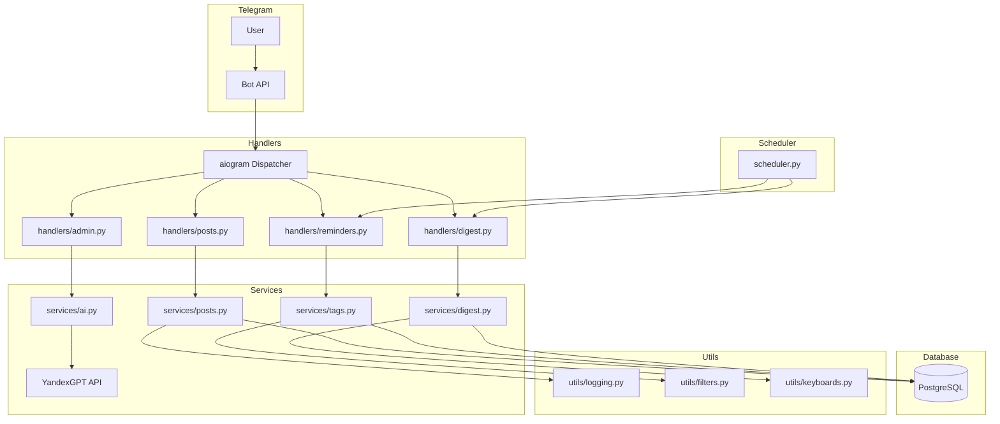

# 🏗 Архитектура (Mermaid)

```mermaid
flowchart TD
    subgraph Telegram
        A[User] --> B[Bot API]
    end

    B --> C[aiogram Dispatcher]

    subgraph Handlers
        C --> H1[handlers/posts.py]
        C --> H2[handlers/reminders.py]
        C --> H3[handlers/digest.py]
        C --> H4[handlers/admin.py]
    end

    subgraph Services
        H1 --> S1[services/posts.py]
        H2 --> S2[services/tags.py]
        H3 --> S3[services/digest.py]
        H4 --> S4[services/ai.py]
        S4 --> API[YandexGPT API]
    end

    subgraph Database
        S1 --> DB[(PostgreSQL)]
        S2 --> DB
        S3 --> DB
    end

    subgraph Utils
        S1 --> U1[utils/logging.py]
        S2 --> U2[utils/filters.py]
        S3 --> U3[utils/keyboards.py]
    end

    subgraph Scheduler
        SCH[scheduler.py] --> H2
        SCH --> H3
    end
```
