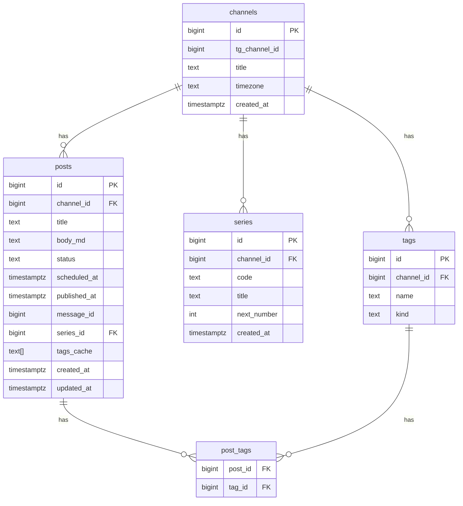

# 🧬 ERD (Mermaid)

```mermaid
erDiagram
  channels ||--o{ posts : has
  channels ||--o{ series : has
  channels ||--o{ tags : has
  posts ||--o{ post_tags : has
  tags ||--o{ post_tags : has

  channels {
    bigint id PK
    bigint tg_channel_id
    text title
    text timezone
    timestamptz created_at
  }
  posts {
    bigint id PK
    bigint channel_id FK
    text title
    text body_md
    text status
    timestamptz scheduled_at
    timestamptz published_at
    bigint message_id
    bigint series_id FK
    text[] tags_cache
    timestamptz created_at
    timestamptz updated_at
  }
  series {
    bigint id PK
    bigint channel_id FK
    text code
    text title
    int next_number
    timestamptz created_at
  }
  tags {
    bigint id PK
    bigint channel_id FK
    text name
    text kind
  }
  post_tags {
    bigint post_id FK
    bigint tag_id FK
  }
```
