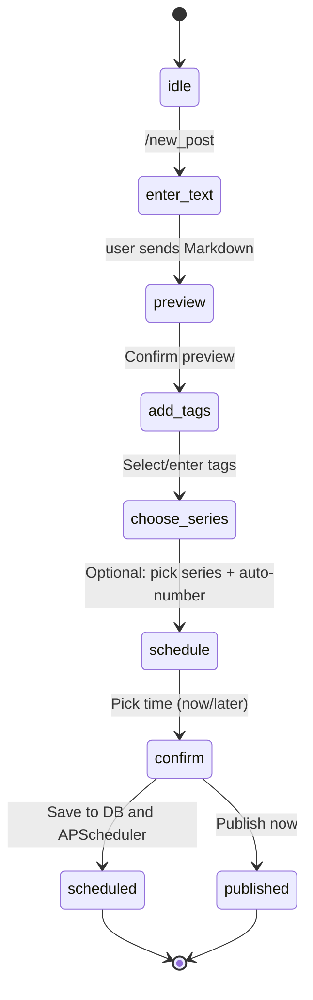

# 🔄 FSM: создание/публикация поста

```mermaid
stateDiagram-v2
  [*] --> idle
  idle --> enter_text: /new_post
  enter_text --> preview: user sends Markdown
  preview --> add_tags: Confirm preview
  add_tags --> choose_series: Select/enter tags
  choose_series --> schedule: Optional: pick series + auto-number
  schedule --> confirm: Pick time (now/later)
  confirm --> scheduled: Save to DB and APScheduler
  confirm --> published: Publish now
  scheduled --> [*]
  published --> [*]
```
**Ошибки/валидация**: обязательный хотя бы один тег, лимит на длину, запрет «пустого дня» при строгом режиме.
