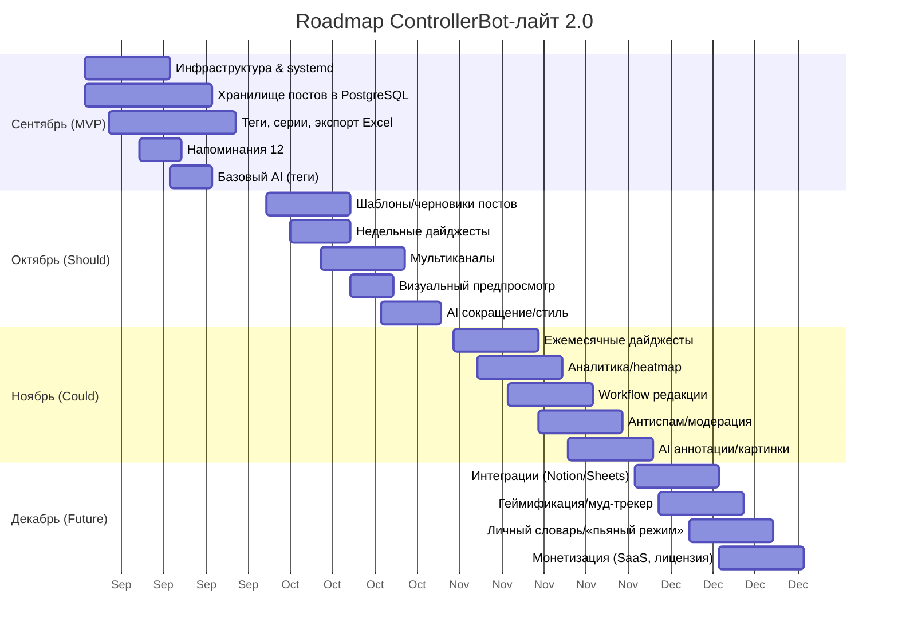

# 📊 Roadmap (Mermaid)

```mermaid
gantt
    title Roadmap ControllerBot-лайт 2.0
    dateFormat  YYYY-MM-DD
    axisFormat  %b

    section Сентябрь (MVP)
    Инфраструктура & systemd     :a1, 2025-09-01, 14d
    Хранилище постов в PostgreSQL :a2, 2025-09-01, 21d
    Теги, серии, экспорт Excel    :a3, 2025-09-05, 21d
    Напоминания 12:00/21:00       :a4, 2025-09-10, 7d
    Базовый AI (теги)             :a5, 2025-09-15, 7d

    section Октябрь (Should)
    Шаблоны/черновики постов      :b1, 2025-10-01, 14d
    Недельные дайджесты           :b2, 2025-10-05, 10d
    Мультиканалы                  :b3, 2025-10-10, 14d
    Визуальный предпросмотр       :b4, 2025-10-15, 7d
    AI сокращение/стиль           :b5, 2025-10-20, 10d

    section Ноябрь (Could)
    Ежемесячные дайджесты         :c1, 2025-11-01, 14d
    Аналитика/heatmap             :c2, 2025-11-05, 14d
    Workflow редакции             :c3, 2025-11-10, 14d
    Антиспам/модерация            :c4, 2025-11-15, 14d
    AI аннотации/картинки         :c5, 2025-11-20, 14d

    section Декабрь (Future)
    Интеграции (Notion/Sheets)    :d1, 2025-12-01, 14d
    Геймификация/муд-трекер       :d2, 2025-12-05, 14d
    Личный словарь/«пьяный режим»:d3, 2025-12-10, 14d
    Монетизация (SaaS, лицензия)  :d4, 2025-12-15, 14d
```
